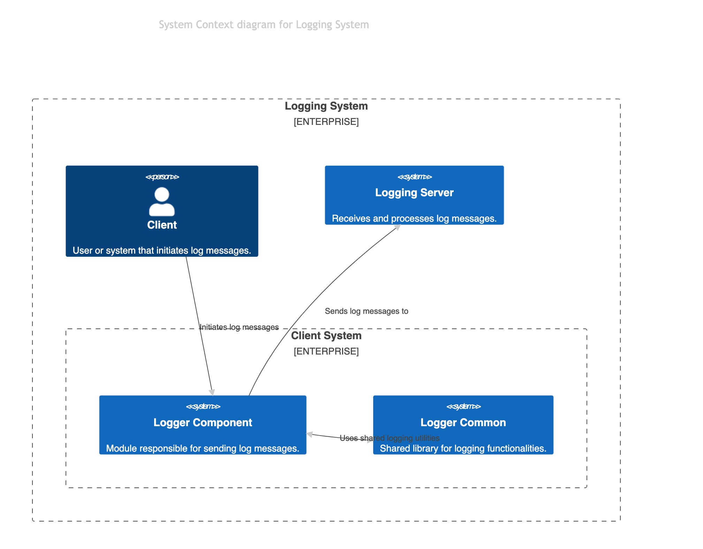
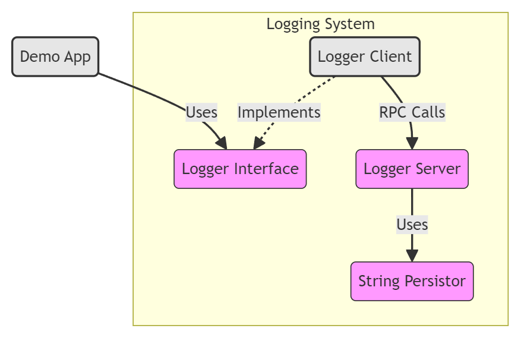
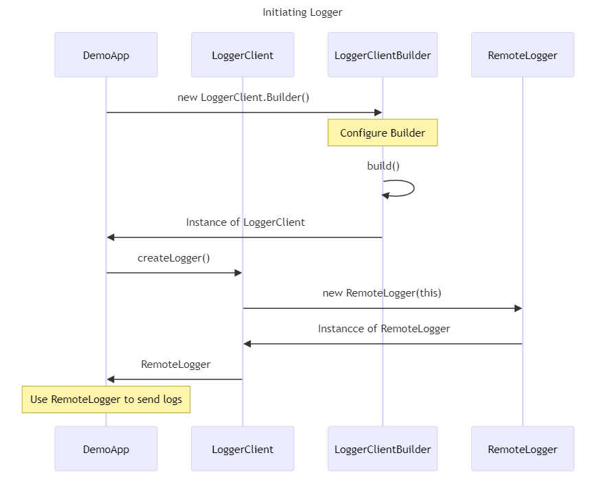
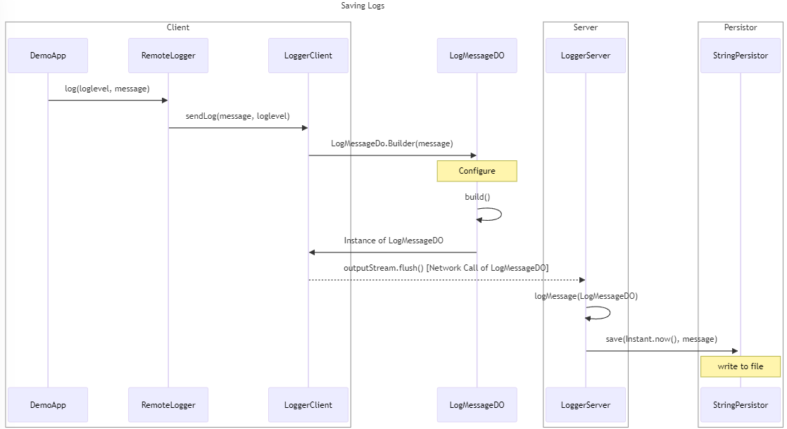

# C4 Modell

## C1 Architektur Diagram

### Übersicht
- **Issue**: https://gitlab.switch.ch/hslu/edu/bachelor-computer-science/vsk/24fs01/g08/g08-documentation/-/issues/15[C1 Architektur Diagram]
- **Autor**: @icsenn
- **Erstelldatum**: 14.04.2022


- **Client-System**: Dies ist der Ort, an dem der Benutzer oder das System die Protokollmeldungen initiiert.
- **Protokollserver**: Ein System, das Protokollnachrichten vom Client empfängt und sie möglicherweise speichert oder verarbeitet.
- **Logger Common**: Eine gemeinsame Bibliothek oder ein Satz von Dienstprogrammen, die sowohl vom Client als auch vom Server verwendet werden, um die Protokollierung zu erleichtern.
- **Logger-Komponente**: Ein spezifisches Modul oder eine Komponente innerhalb des Client-Systems, das/die für das Senden von Protokollnachrichten verantwortlich ist.
- **Logger-Server**: Die serverseitige Anwendung, die eingehende Protokollnachrichten verarbeitet.

Mermaid Diagram Code:

```mermaid
C4Context
  title System Context diagram for Logging System
  Enterprise_Boundary(eb, "Logging System") {
    Person(client, "Client", "User or system that initiates log messages.")
    System_Boundary(sb, "Client System") {
      System(loggerComponent, "Logger Component", "Module responsible for sending log messages.")
      System(loggerCommon, "Logger Common", "Shared library for logging functionalities.")
    }
    System(loggerServer, "Logging Server", "Receives and processes log messages.")

    Rel(client, loggerComponent, "Initiates log messages")
    BiRel(loggerComponent, loggerCommon, "Uses shared logging utilities")
    Rel(loggerComponent, loggerServer, "Sends log messages to")
  }
```



## C2 Container Diagram

### Übersicht
- **Issue**: https://gitlab.switch.ch/hslu/edu/bachelor-computer-science/vsk/24fs01/g08/g08-documentation/-/issues/16[C2 Architektur Diagram]
- **Autor**: @eldar.omerovic1
- **Erstelldatum**: 16.04.2022

[mermaid, format="svg", opts="inline"]
----
graph TB
    %% C2 Level - Container Diagram for DemoApp
    subgraph "Logging System"
        LoggerClient(Logger Client) -. "Implements" .-> LoggerInterface(Logger Interface)
        LoggerClient -- "RPC Calls" --> LoggerServer(Logger Server)
        LoggerServer -- "Uses" --> StringPersistor(String Persistor)
    end

    DemoApp(Demo App) -- "Uses" --> LoggerInterface

    classDef system fill:#e6e6e6,stroke:#333,stroke-width:2px;
    classDef container fill:#f9f,stroke:#333,stroke-width:1px;
    classDef external fill:#ff9,stroke:#333,stroke-width:1px;
    class LoggerInterface,LoggerCommon,LoggerServer,StringPersistor container;
    class DemoApp,LoggerClient system;
----



## C4 Erstellen einer Logger Instanz

### Übersicht
- **Issue**: -
- **Autor**: @eldar.omerovic1
- **Erstelldatum**: 16.04.2022

Dieses Sequenzdiagram zeigt die Instanzierung einer RemoteLogger Instanz um Log-Nachrichten zu senden.

[mermaid, format="svg", opts="inline"]
----
sequenceDiagram
    title Initiating Logger
    participant DA as DemoApp
    participant LC as LoggerClient
    participant LCB as LoggerClientBuilder
    participant L as RemoteLogger

    DA->>LCB: new LoggerClient.Builder()
    Note over LCB: Configure Builder
    LCB->>LCB: build()
    LCB->>DA: Instance of LoggerClient
    DA->>LC: createLogger()
    LC->>L: new RemoteLogger(this)
    L->>LC: Instancce of RemoteLogger
    LC->>DA: RemoteLogger
    Note over DA: Use RemoteLogger to send logs
----



## C4 Senden und Speichern von Lognachrichten

### Übersicht
- **Issue**: -
- **Autor**: @eldar.omerovic1
- **Erstelldatum**: 16.04.2022E

Dieses Sequenzdiagram zeigt wie eine Nachricht gesendet und gespeichert wird.

[mermaid, format="svg", opts="inline"]
----
sequenceDiagram
    title Saving Logs
    box Client
    participant DA as DemoApp
    participant RL as RemoteLogger
    participant LC as LoggerClient
    end
    participant LMD as LogMessageDO
    box Server
    participant LS as LoggerServer
    end
    box Persistor
    participant SP as StringPersistor
    end

    DA->>RL: log(loglevel, message)
    RL->>LC: sendLog(message, loglevel)
    LC->>LMD: LogMessageDo.Builder(message)
    Note over LMD: Configure
    LMD->>LMD: build()
    LMD->>LC: Instance of LogMessageDO
    LC-->>LS: outputStream.flush() [Network Call of LogMessageDO]
    LS->>LS: logMessage(LogMessageDO)
    LS->>+SP: save(Instant.now(), message)
    Note over SP: write to file 
----

