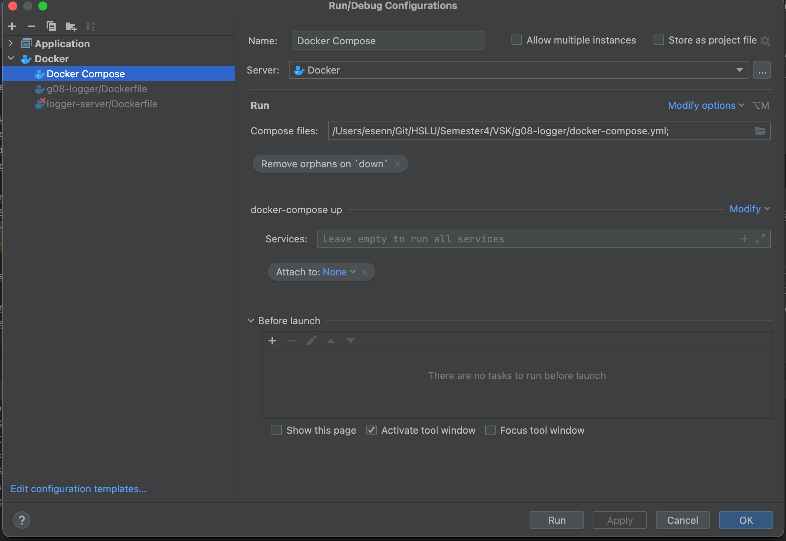

# Auslieferung des Logger-Servers in einem Dockercontainer

## Übersicht
- **Issue**: https://gitlab.switch.ch/hslu/edu/bachelor-computer-science/vsk/24fs01/g08/g08-documentation/-/issues/13[Auslieferung des Logger-Servers in einem Dockercontainer]
- **Autor**: @icsenn
- **Erstelldatum**: 14.04.2022

## Dockerfile

Es wurde ein Dockerfile erstellt um den Logger-Server in einem Dockercontainer auszuliefern. Das Dockerfile ist folgendermasen aufgebaut. Es nutzt die Eclipse Temurin Java Runtime Environment (JRE) für eine effiziente Ausführung der Java-Anwendung, wobei die Version 21 der JRE verwendet wird.

Hier ist eine detaillierte Beschreibung der einzelnen Schritte:

### Basisimage
```dockerfile
FROM eclipse-temurin:21-jre
```
Dieser Schritt definiert das Basisimage des Containers. `eclipse-temurin:21-jre` ist ein offizielles Image, das die Eclipse Temurin-Version der Java Runtime Environment (Version 21) enthält, welche optimiert ist für die Ausführung von Java-Anwendungen. Die Wahl der JRE (anstatt einer JDK) hilft dabei, die Größe des Images gering zu halten, da die JRE weniger Komponenten als die JDK enthält und für die Ausführung von Java-Anwendungen ausreicht.

### Arbeitsverzeichnis
```dockerfile
WORKDIR /app
```
Dieser Befehl setzt das Arbeitsverzeichnis im Container auf `/app`. Alle folgenden Befehle wie `COPY`, `RUN` oder `CMD` beziehen sich auf dieses Verzeichnis.

### Kopieren von Dateien
```dockerfile
COPY logger-server/target /app/target
```
Hier werden die Inhalte des `target`-Verzeichnisses aus dem lokalen `logger-server`-Verzeichnis in das `/app/target`-Verzeichnis innerhalb des Docker-Containers kopiert. Dieses Verzeichnis enthält typischerweise die kompilierten Java-Archive (.jar-Dateien), die für die Ausführung der Anwendung erforderlich sind, sowie möglicherweise weitere Ressourcen, die zur Laufzeit benötigt werden.

### Portfreigabe
```dockerfile
EXPOSE 8080
```
Dieser Befehl gibt den Port 8080 im Container frei. Es wird davon ausgegangen, dass die Java-Anwendung auf diesem Port lauscht. Durch das Freigeben des Ports kann der Container Netzwerkverbindungen auf diesem Port von außerhalb des Docker-Hosts akzeptieren.

### Auflistung der Inhalte
```dockerfile
RUN ls -lisat /app/target
```
Dieser Befehl listet den Inhalt des Verzeichnisses `/app/target` auf, um eine Überprüfung und Dokumentation der bereitgestellten Dateien zu ermöglichen. Dies ist besonders nützlich für Debugging-Zwecke oder zur Bestätigung, dass die erwarteten Dateien korrekt in das Image kopiert wurden.

### Startbefehl
```dockerfile
CMD ["java", "-jar", "/app/target/g08-loggerserver-2.0.0-SNAPSHOT.jar"]
```
Dies ist der Befehl, der beim Start des Containers ausgeführt wird. Er startet die Java-Anwendung, indem er die JRE verwendet, um die Jar-Datei `g08-loggerserver-2.0.0-SNAPSHOT.jar` auszuführen. Dieser Schritt ist entscheidend für die Funktionalität des Containers, da er definiert, wie die Anwendung ausgeführt wird.


## Shade Plugin

### Problemstellung

Nach dem erstellen des Dockerfile war es jedoch immernoch nicht möglich die Applikation zu starten. Da der Logger-Server auf externe dependencies angewiesen war, wie zum beispiel der StringPersistor. Um dieses Problem zu lösen entschieden wir uns ein Fatjar zu erstellen.

### Lösung durch das Maven Shade Plugin

Das Maven Shade Plugin bietet eine Lösung für diese Probleme, indem es ermöglicht, alle Abhängigkeiten in einer einzigen ausführbaren Jar-Datei zu bündeln. Dies erleichtert das Deployment und stellt sicher, dass die Anwendung mit allen ihren Abhängigkeiten in jeder Umgebung ausgeführt werden kann.

### Konfiguration des Plugins

Hier ist die Erläuterung der spezifischen Konfiguration des Plugins in Ihrem Maven-Projekt:

```xml
<plugin>
    <groupId>org.apache.maven.plugins</groupId>
    <artifactId>maven-shade-plugin</artifactId>
    <version>3.5.2</version>
    <executions>
        <execution>
            <phase>package</phase>
            <goals>
                <goal>shade</goal>
            </goals>
            <configuration>
                <createDependencyReducedPom>false</createDependencyReducedPom>
                <transformers>
                    <transformer implementation="org.apache.maven.plugins.shade.resource.ManifestResourceTransformer">
                        <mainClass>${jar.start.class}</mainClass>
                    </transformer>
                </transformers>
            </configuration>
        </execution>
    </executions>
</plugin>
```

- **Phase**: Das Plugin ist so konfiguriert, dass es in der `package`-Phase des Maven Lebenszyklus aktiv wird.
- **Ziele (Goals)**: Das `shade`-Ziel sorgt dafür, dass das Plugin das Uber-Jar erstellt.
- **Konfiguration**:
- `createDependencyReducedPom`: Wenn auf `false` gesetzt, wird kein reduziertes POM generiert, das normalerweise Konflikte bei Abhängigkeiten vermeiden hilft.
- **Transformer**: Der `ManifestResourceTransformer` wird verwendet, um die `Main-Class`-Spezifikation im Manifest des Jars zu setzen, was für ausführbare Jars notwendig ist. Die Klasse, die als Einstiegspunkt der Anwendung dient (`mainClass`), wird durch die Property `${jar.start.class}` spezifiziert.

Diese Konfiguration stellt sicher, dass das gebaute Jar-Archiv als eigenständige Anwendung mit allen notwendigen Abhängigkeiten ausgeführt werden kann, was die Bereitstellung und Ausführung in verschiedenen Umgebungen erheblich vereinfacht.

## Docker-compose

Für die Dokumentation des Prozesses zur Vereinfachung der Build-, Push- und Run-Schritte einer Docker-Anwendung mithilfe von Docker Compose können Sie die folgende Beschreibung verwenden. Diese Dokumentation erläutert den Übergang von manuellen Docker-Befehlen zu einer automatisierten und vereinfachten Vorgehensweise durch Docker Compose, die den Workflow effizienter und fehlerresistenter macht.

### Vor Docker Compose:

Vor der Einführung von Docker Compose mussten mehrere manuelle Befehle ausgeführt werden, um das Docker-Image zu bauen, in ein Registry zu pushen und schließlich den Container zu starten. Die Schritte umfassten:

1. **Build des Images**:
```bash
docker build --no-cache --progress=plain -t icsenn/loggerserver:1.0.0 .
```
Dieser Befehl baut das Docker-Image ohne Cache, um sicherzustellen, dass alle Schichten neu erstellt werden, und gibt den Fortschritt unformatiert aus.

2. **Push des Images**:
```bash
docker push icsenn/loggerserver:1.0.0
```
Nach dem erfolgreichen Build wird das Image in ein Docker-Repository hochgeladen, sodass es überall verfügbar ist.

3. **Ausführen des Containers**:
```bash
docker run -p 9999:9999 8522dee74dc190ec326c87f7d002768ed00c07d6e8b9daef02e553aa237933e8
```
Um den Container zu starten, war es notwendig, die spezifische Image-ID zu kennen, was zusätzlichen Aufwand beim Kopieren und Einfügen der ID nach dem Build-Prozess erforderte.

### Mit Docker Compose:

Durch die Einführung von Docker Compose werden die oben genannten Schritte in einer einzigen Konfigurationsdatei zusammengefasst. Dies vereinfacht den Prozess erheblich und reduziert das Potenzial für menschliche Fehler. Hier ist eine kurze Erklärung der `docker-compose.yml`:

```yaml
version: '3.8'

services:
  logger-server:
    build: .  # Baut das Image basierend auf dem Dockerfile im aktuellen Verzeichnis
    ports:
      - "9999:9999"  # Mappt Port 9999 des Containers auf Port 9999 des Hosts
    container_name: logger_server
    restart: unless-stopped  # Startet den Container neu, falls dieser abstürzt, außer er wird manuell gestoppt
    environment:
      - JAVA_OPTS=-Xmx256m -Xms128m  # Setzt Java-Optionen für das Speichermanagement
    volumes:
      - ./data:/app/data  # Optional: Bindet ein Host-Verzeichnis für persistente Daten
```

**Vorteile von Docker Compose**:

1. **Automatisierung**: Alle Schritte zum Bauen, Hochladen und Ausführen des Containers werden durch einfache Befehle automatisiert.
2. **Konfiguration als Code**: Die gesamte Konfiguration ist als Code festgehalten, was die Wartung und das Versionsmanagement verbessert.
3. **Einfachheit**: Kein manuelles Kopieren von Image-IDs; `docker-compose up` kümmert sich um den gesamten Prozess.
4. **Konsistenz**: Reduziert Fehlerquellen und gewährleistet Konsistenz über Entwicklungs-, Test- und Produktionsumgebungen hinweg.

**Anwendung**:
- Zum Starten des Services einfach den folgenden Befehl im Verzeichnis der `docker-compose.yml` ausführen:
```bash
docker-compose up --build
```
- Dieser Befehl baut das Image (falls notwendig), startet den Container und führt alle Konfigurationsschritte aus.

**Anwendung Run Configuration**:
Um diese Konfiguration in einer IDE wie IntelliJ IDEA zu verwenden, können Sie eine Run Configuration erstellen, die den `docker-compose up --build` Befehl ausführt. Dadurch wird der Entwicklungsprozess weiter vereinfacht und beschleunigt.



