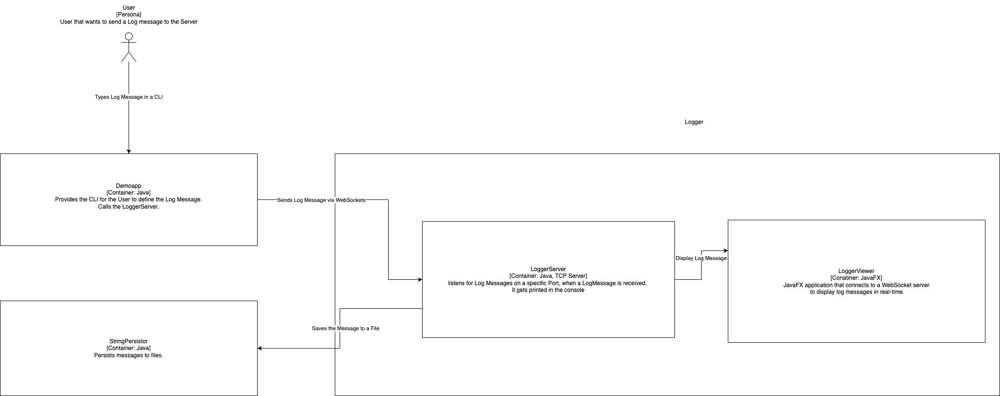

== C4 Modell

== C1 Context Diagram

Das Kontextdiagramm zeigt die Beziehung zwischen dem Logging-System und den externen Systemen oder Benutzern. Es zeigt, wie das Logging-System mit anderen Systemen interagiert und welche Rollen die Benutzer oder Systeme in diesem Kontext spielen.

== C2 Container Diagram
Das Container-Diagramm zeigt die internen Komponenten und deren Beziehungen zueinander. Es zeigt die verschiedenen Container, aus denen das Logging-System besteht, und wie sie miteinander kommunizieren.

== C3 Component Diagram
Das Komponentendiagramm zeigt die internen Komponenten und deren Beziehungen zueinander. Es zeigt die verschiedenen Komponenten, aus denen das Logging-System besteht, und wie sie miteinander interagieren.

== C4 Class Diagram

Das Klassendiagramm stellt die Struktur und die Beziehungen der verschiedenen Klassen in einem komplexen Logging-System dar. Es besteht aus mehreren Hauptkomponenten, die jeweils spezifische Aufgaben und Verantwortlichkeiten haben, um die gesamte Funktionalität des Systems zu gewährleisten.

### Hauptkomponenten

1. **DemoApp**
Die `DemoApp`-Klasse enthält die `main`-Methode, die den Einstiegspunkt der Anwendung darstellt. Diese Methode initialisiert das System und startet den Anwendungslauf.

2. **ConfigHandler**
Der `ConfigHandler` ist für das Laden und Verwalten der Konfiguration der Anwendung zuständig. Er besitzt Attribute wie `configFilePath`, `applicationConfig`, `portNumber`, `logLevel` und `localAddress`. Methoden wie `loadConfiguration` und `getApplicationConfig` ermöglichen das Einlesen und Abrufen der Konfigurationsdaten.

3. **LoggerServer**
Diese Klasse startet und verwaltet den Logging-Server. Der `LoggerServer` enthält Methoden wie `main` und `start`, die für den Serverstart und die Steuerung verantwortlich sind.

4. **LogFormatter**
`LogFormatter` ist eine abstrakte Klasse, die die Methode `format` definiert, welche eine `LogMessage` in einen String umwandelt. Diese Klasse wird von spezifischen Formatierungsklassen wie `CSVLogFormatter`, `TextLogFormatter` und `ComponentIdFormatter` erweitert, die jeweils ihre eigenen Implementierungen der `format`-Methode bieten.

5. **FilterHandler**
Die Klasse `FilterHandler` ist für die Verarbeitung und Filterung von Log-Nachrichten zuständig. Methoden wie `convertFromExisting` und `persistLogMessage` ermöglichen die Konvertierung und Speicherung von Log-Daten.

6. **FindStringParameter**
Diese Klasse unterstützt das Finden und Verarbeiten von String-Parametern. Sie bietet Methoden wie `convertFromExisting` und `persistString`, um Strings in verschiedenen Kontexten zu bearbeiten.

7. **LoggerClientBuilder**
Der `LoggerClientBuilder` hilft beim Aufbau von Logger-Clients. Er enthält Attribute wie `hostname`, `port` und `useHttps` sowie die Methode `build`, die einen `LoggerClient` erstellt.

8. **LoggerClient**
Die `LoggerClient`-Klasse stellt einen Client dar, der Log-Nachrichten an den Server sendet. Sie verwendet den `LoggerClientBuilder` für die Initialisierung und bietet Methoden wie `sendLogMessage`, um Nachrichten zu senden.

9. **LoggerViewer**
`LoggerViewer` ist eine Klasse, die Log-Nachrichten visualisiert. Sie verwendet einen `WebSocketClient` für die Kommunikation und bietet Methoden wie `reconnect` und `receiveLogMessage`, um Verbindungen zu verwalten und Nachrichten zu empfangen.

10. **LoggerViewerHandler**
Diese Klasse verwaltet mehrere `LoggerViewer` und bietet Methoden wie `addViewer`, `removeViewer` und `broadcastLogMessage`, um Viewer hinzuzufügen, zu entfernen und Nachrichten an alle Viewer zu senden.

11. **LogMessage**
`LogMessage` repräsentiert eine Log-Nachricht und enthält Attribute wie `timestamp`, `logLevel` und `message`. Ein integrierter Builder ermöglicht den einfachen Aufbau von Log-Nachrichten mit Methoden wie `withTimestamp`, `withLogLevel` und `withMessage`.

12. **LogReceiverServer**
Diese Klasse empfängt Log-Nachrichten und bietet die Methode `receiveLogMessage` zum Verarbeiten eingehender Nachrichten.

13. **LogMessageImportHandler**
`LogMessageImportHandler` importiert Log-Nachrichten aus einer Datei und bietet die Methode `importMessagesFromFile`, um Nachrichten aus einer Datei zu laden.

### Beziehungen

Die Klassen im Diagramm sind durch verschiedene Arten von Beziehungen miteinander verbunden:

- **Vererbung**: Die Klassen `CSVLogFormatter`, `TextLogFormatter` und `ComponentIdFormatter` erben von der abstrakten Klasse `LogFormatter`.
- **Assoziationen**: Es gibt viele Assoziationen zwischen den Klassen, die zeigen, wie sie miteinander interagieren. Beispielsweise verwendet `LoggerClient` den `LoggerClientBuilder` für die Initialisierung und `LoggerViewerHandler` verwaltet mehrere `LoggerViewer`.
